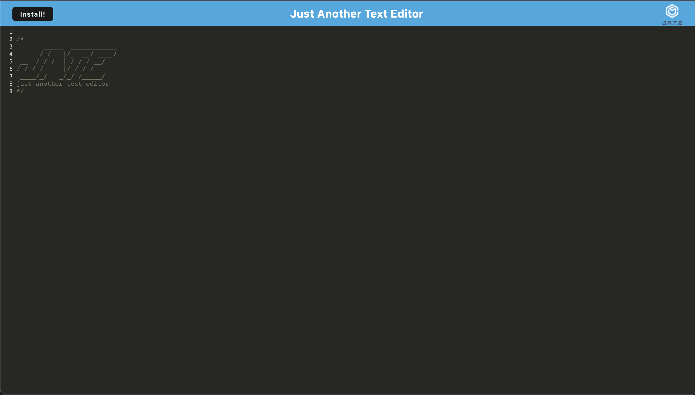
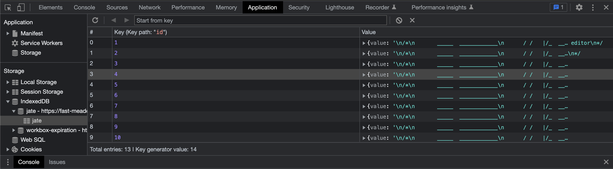

# WPA Text Editor 

## Description

This is a small web application that allows for the use of a text editor when disconnected from the internet. The user can also install a web browse plugin to launch the web app from their desktop. The Application is capable of saving the users input by storing the values in a generated IndexDB.

[Link to Live Site](https://fast-meadow-68844.herokuapp.com/)

# Table of Contents

[Description](#description)

[How to Install](#install)

[How to Use](#usage)

[How to contribute](#contribute)

[How to Test](#test)

[License](#license)

[Contact Me](#contact)

## Installation

To Install this web application to your desktop, go to the live link of the website and either click the install button in the top right or the button in the URL on the far right

## Usage

In-order to use the web application, use it like you would use vs code or any other text editor. Simple coppy over your code to a desired locaton

## Contributing

If you would like to to contribute to this project or have any questions, please reach out to me via my email

## Tests

After adding in lines of code, go to your google dev tools (right click and hit inspect on the webpage) and check:

## License

This project is licensed under the MIT license.
See [LICENSE](https://www.mit.edu/~amini/LICENSE.md) for more information!

## Question

If you have any questions or concerns about this project please contact me!

My gitHub account is: MMount98

Link to my [gitHub](https://github.com/MMount98) Account

You can always reach out via my email: Mount.Photos@gmail.com
